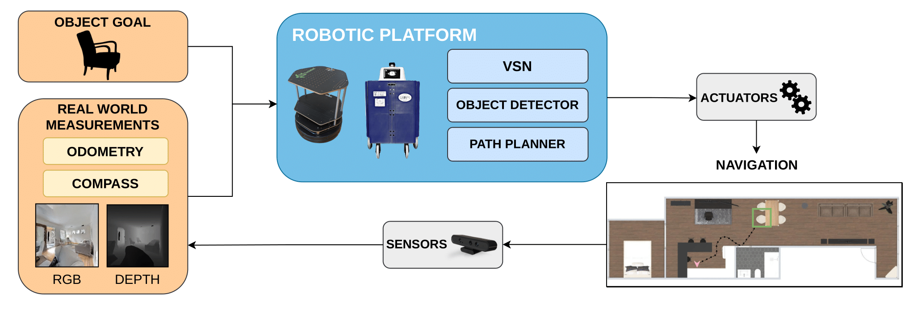
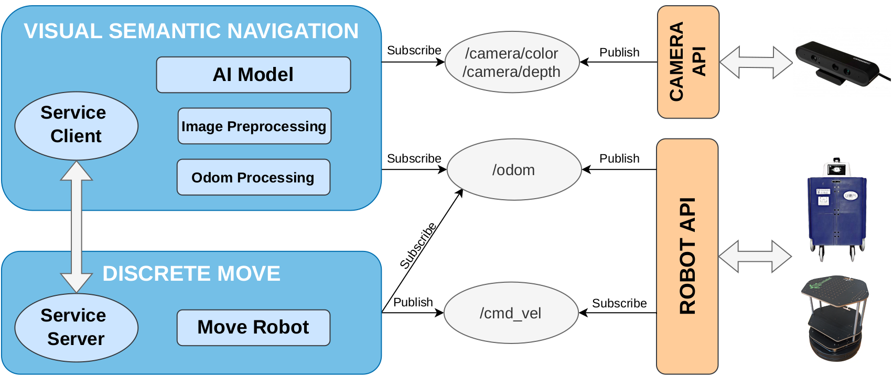

# ROS4VSN: Visual Semantic Navigation with Real Robots



In this repository we release a novel ROS-based framework for Visual Semantic Navigation (VSN), designed to simplify the deployment of VSN models on any ROS-compatible robot in the real world.
This work has been detailed in our <a href="https://arxiv.org/abs/2311.16623"> [paper]</a>.


**If you use any content of this repo for your work, please cite the following bib entry:**


If you use this code in your research, please consider citing:

```
@article{Gutierrez-Alvarez2025,
author={Guti{\'e}rrez-{\'A}lvarez, Carlos and R{\'i}os-Navarro, Pablo and Flor-Rodr{\'i}guez-Rabad{\'a}n, Rafael and Acevedo-Rodr{\'i}guez, Francisco Javier and L{\'o}pez-Sastre, Roberto Javier},
title={Visual semantic navigation with real robots},
journal={Applied Intelligence},
year={2025},
volume={55},
number={3},
pages={206},
issn={1573-7497},
doi={10.1007/s10489-024-06115-4}
}

```


The ROS framework we present is composed of two main packages:
1. visual_semantic_navigation (vsn)
2. discrete_move


The following image shows the architecture presented in the paper:




## visual_semantic_navigation (vsn) package
The [vsn](catkin_ws/src/vsn) Package is designed to deploy artificial intelligence models capable of autonomous navigation. 
This package is a client that interacts with the  [discrete_move](catkin_ws/src/discrete_move) package, 
which is responsible for performing the discrete movements inferred by the AI model.

Additionally, This package contains two submodules:
* [Image_preprocessing](catkin_ws/src/vsn/scripts/image_preprocessing.py) that is responsible for connecting to the camera via ROS topic and returning an RGB or RGB+D image in the form of a NumPy array.
* [Odometry](catkin_ws/src/vsn/scripts/odometry.py) that return the odometry value of the robot in case it needs to be used in the IA model. 

In summary, VSN package is designed to be a template that can be easily customized to deploy any AI model. 
By using the discrete_move service, the robot can execute the movements generated by the model in a precise and controlled manner.


## discrete_move package
This ROS [package](catkin_ws/src/discrete_move) is designed to control the Robot through parameterized movements, allowing the user
to specify the distance and angle of each movement. The package supports four possible movements:
  * **Forward**
  * **Backward**
  * **Turn left**
  * **Turn right**

Furthermore, a ROS server has been designed to enable other ROS packages to connect as clients and execute parameterized discrete movements.
The forward and backward movements can be controlled by specifying the distance that the robot needs to travel, 
while the turn left and turn right movements can be parameterized with the exact angle of movement required.

In summary, this ROS package provides a powerful tool for controlling the Lola Robot with a high degree of  precision, 
making it an excellent choice for a wide range of applications.

## Prerequisites:
* Ubuntu 20.04
* ROS Noetic
* Turtlebot2 Robot
* Camera compatible with ROS


## Installing the Project:
1. **Turtlebot2 Package Installation on ROS Noetic**: To begin, install the Turtlebot2 package on ROS Noetic. We've created a [script](scripts/install_turtlebot.sh) for your convenience.


2. **Making our Packages Compatible with Turtlebot**: To ensure compatibility with Turtlebot, add the following line to the beginning of the *minimal.launch* file within the ROS package named turtlebot:

```
<remap from="mobile_base/commands/velocity" to="cmd_vel"/>
```

3. **Camera ROS Compatibility Installation**: Ensure your camera is ROS-compatible, in our case we have used Orbecc Astra Camera. 
If needed, we've also prepared a [script](scripts/install_camera.sh) to assist with the installation.

4. **Compilling the Project**: Once the previous steps have been completed, compile the project using the following commands:

```
cd catkin_ws
catkin_make
```
## Launching the Project with random movements:
This project can be launched with random movements to test the functionality of the discrete_move server. 
This random movements substitute the AI model and are generated by the [ia.py](catkin_ws/src/vsn/scripts/ia.py) python script.


Before launching the project, ensure that the Turtlebot and camera is connected to the Turtlebot.

1. **Launching the discrete_move server**: To begin, launch the discrete_move server using the following command in a terminal:

```
. devel/setup.bash
roslaunch discrete_move turtlebot_server.launch
```

2. **Launching the VSN client**: To begin, launch the VSN client using the following command in a terminal:

```
. devel/setup.bash
roslaunch vsn vsn.launch
```

By following these steps, you'll be able to launch the project with randomized movements for a comprehensive functionality test.


## Launching the Project with PIRLNAV:
This repository is designed for seamless integration with the PIRLNAV model, enhancing your robotic navigation capabilities.  
To deploy the PIRLNAV model successfully using ROS4VSN, follow the step-by-step instructions in the [examples](examples) directory. In this folder, you will find a detailed guide in the [README](examples/pirlnav/README.md) file.
